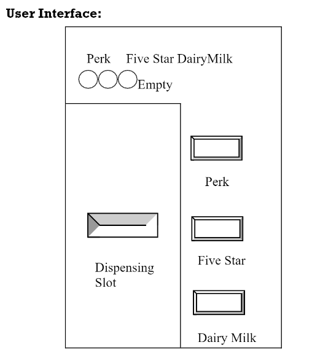
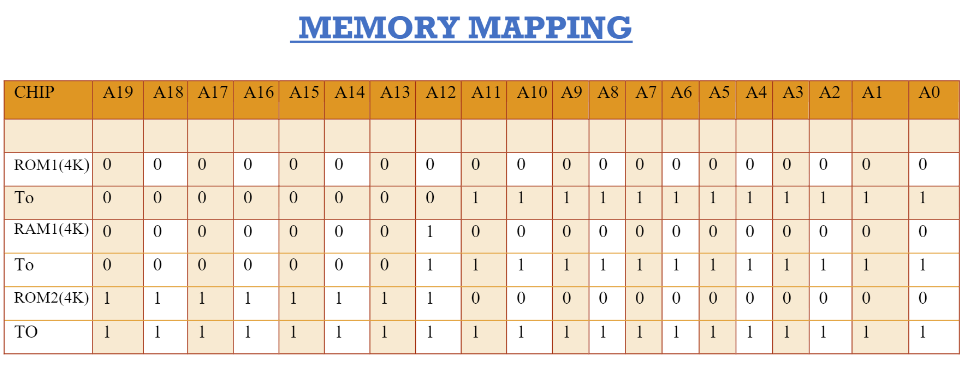

# Chocolate-Vending-Machine
Project done during coursework of Microprocessor and Interfacing

PROBLEM:
DESCRIPTION:This automatic machine vendthree different types of chocolates.
Perk: Rs. 5.00
Five-Star: Rs10
Dairy Milk: Rs20.
The currency has to be given in terms of 5 Rupee coins. A weight sensor is used to detect whether the coin is a Rs 5 coin or not. There are three buttons available for the selection of the chocolate. After the chocolate has been selected, the user has to put the correct currency into the coin slot. When the user has dropped the entire amount into the slot, the machine dispenses the correct chocolate.
LED’s are used as indicators to show if any of the chocolates being vended are not available.

User Interface:

